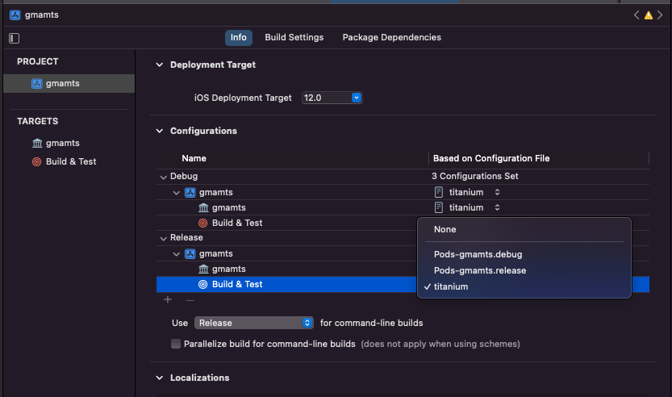

# Titanium GoogleMobileAdsMediationTestSuite Module

Open the [Google Mobile Ads Mediation Test Suite](https://developers.google.com/admob/ios/mediation-test-suite?hl=en) in a Titanium iOS app

You can use this module if your app shows AdMob ads. It allows you to test whether you have correctly configured your app and ad units to be able to display ads from third-party networks through mediation (InMobi, Facebook Audience Network, etc...)

You don't need `ti.gmamts` module if you use the [ti.admob](https://github.com/Astrovic/ti.admob/) module, this method has been added since [iOS version 4.8.0](https://github.com/Astrovic/ti.admob/releases/tag/ios-4.8.0), so you can directly use:

If you use the [ti.admob](https://github.com/Astrovic/ti.admob/), *Google Mobile Ads Mediation Test Suite* is included starting with the [iOS version 4.8.0](https://github.com/Astrovic/ti.admob/releases/tag/ios-4.8.0), so you don't need `ti.gmamtsm` module, but you can use it directly with `ti.admob`:
```js
var Admob = require('ti.admob');
Admob.showMediationTestSuite();
```


## Prerequisites

- iOS 10.0 or higher
- Create an [AdMob account](https://support.google.com/admob/answer/2784575) and [register an app](https://support.google.com/admob/answer/2773509).
- Ensure you have correctly entered your **app ID** in your `tiapp.xml`.

```js
<ios>
    <plist>
        <dict>        
            <key>GADApplicationIdentifier</key>
            <string>ca-app-pub-XXXXXXXXXXXXXXXX~XXXXXXXXXX</string>
        </dict>
    </plist>
</ios>
```

## Example Usage

**tiapp.xml**
```js
...
...
<ios>
    <plist>
        <dict>        
            <key>GADApplicationIdentifier</key>
            <string><!--YOUR APP-ID ca-app-pub-XXXXXXXXXXXXXXXX~XXXXXXXXXX --></string>
        </dict>
    </plist>
</ios>
...
...
<modules>
  <module platform="iphone">ti.gmamts</module>
</modules>
```

**index.js** 

```js
var gmamts = require('ti.gmamts');
gmamts.showMediationTestSuite();
```

## Build using cocoapod

This module is built using cocoapods. They are very useful for automatically downloading frameworks and their dependencies, but they are not officially supported for the development of Titanium iOS modules. 

We need a binary to put into `platform/`, otherwise it won't be packaged with the module and result in linker errors. To do so, we use `cocoapods-binary` plugin. It generates the necessary ***.framework** that we can put into `platform/`.

However you can use them by following these steps:

1. If you haven't already, from a terminal install **cocoapods** and then **cocoapods-binary**
```js
sudo gem install cocoapods
sudo gem install cocoapods-binary
```

2. Change the current working directory to your workspace and run:

`cd /PATH/TO/MODULE`

3. You can go to step 4. I show this step only for those who want to create a new module.:

`ti create -t module -p ios -n gmats --id ti.gmamts`

Titanium creates a basic Xcode project **gmamts.xcodeproj**

4. Go to the module's `/ios` folder and create the Podfile
```js
cd gmamts/ios
pod init
```

5. This generates a **Podfile**. Open and edit the Podfile with the required frameworks:

```js
# Uncomment the next line to define a global platform for your project
plugin 'cocoapods-binary'
install! 'cocoapods',
         :integrate_targets => false
platform :ios, '12.0'
# Comment the next line if you don't want to use dynamic frameworks
  use_frameworks!
target 'gmamts' do  
  # Pods for gmamts
  pod 'GoogleMobileAdsMediationTestSuite', :binary => true
end
````

6. Install the pod with the command

`pod install`

This will do the magic, download and create binaries of all frameworks under **`Pods/_Prebuild/<FrameworkName>/<FrameworkName>.framework`**

7. Now we need to copy all the generated **`<FrameworkName>.framework`** into the `/platform` folder

8. The `install pod` generated a new Xcode project **gmamts.xcworkspace**. We have to use this new one to modify the module. We can open the project manually, or using the terminal

`open gmamts.xcworkspace`

At the end of the **`titanium.xcconfig`** file we need to copy the contents of the **`Pods-gmamts.release.xcconfig`** file. We find it on Xcode in **gmamts > Pods > Pods-gmamts.release.xcconfig** or at path **`/ios/Pods/Target Support Files/Pods-gmamts/Pods-gmamts.release.xcconfig`**

9. Finally we need to set this config file to Xcode. By clicking on the project name and opening the tab **gmamts > Info > Configurations**, we need to change all the **Based on Configuration Files** from *Pods-gmamts.debug/Pods-gmamts.release* to *titanium* (as in the picture below).




10. That's really all now, we just need to build the module:

`ti build -p ios --build-only -l trace`


## Author
Vittorio Sorbera - [AstrovicApps](https://astrovicapps.com/)
